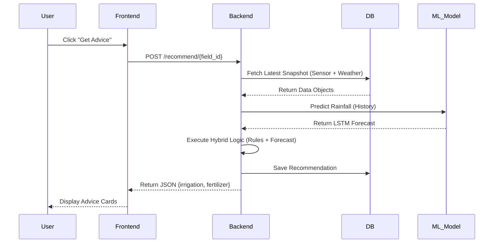

# Architecture Document
**Project:** Smart Multi-Modal Soil & Crop Health Prediction System
**Review:** First Review

## 1. Application: Microservices Architecture
The system adopts a **Microservices Architecture** to ensure scalability, modularity, and independent deployment of core components. The application is containerized using Docker, allowing each service to operate in its own environment.

### 1.1 Service Decomposition
*   **Frontend Service (Client):** A React-based Single Page Application (SPA) served via Vite. It acts as the presentation layer, consuming APIs to display dashboards and handle user interactions.
*   **Backend Service (Core API):** A FastAPI-based service serving as the API Gateway and Orchestrator. It handles authentication, business logic, and data aggregation.
*   **ML Service (Worker):** A specialized Python service (logically separated within the backend codebase or deployable as a separate container) for running heavy computations like LSTM training and inference.
*   **Database Service:** A PostgreSQL container managing persistence for relational data.

### 1.2 Diagram: Deployment / Microservices View
```mermaid
graph TB
    subgraph "Docker Host / Cloud"
        frontend[Frontend Service<br/>(Node/Nginx)]
        backend[Backend API Service<br/>(FastAPI/Uvicorn)]
        db[(PostgreSQL<br/>Database)]
        ml[ML Worker <br/>(Background Tasks)]
    end
    
    User((Farmer)) -->|HTTPS| frontend
    frontend -->|REST/JSON| backend
    backend -->|SQL| db
    backend -->|Internal IPC/Queue| ml
    backend -->|HTTPS| OpenMeteo[External Weather API]
```

---

## 2. Database

### 2.1 ER Diagram
The visual representation of entities and relationships.


### 2.2 Schema Design
The relational schema is optimized for field-centric time-series queries.

| Table | Primary Key | Foreign Keys | Description |
| :--- | :--- | :--- | :--- |
| **farmers** | `id` (UUID) | — | Farmer profile + credentials (password stored as hash). |
| **fields** | `id` (UUID) | `farmer_id` → farmers.id | Physical plot; location (`lat`/`lon`) + crop + growth stage. |
| **sensors** | `id` (UUID) | — | Device registry; includes `type` (Soil/Weather), `metrics`, and operational `status`. |
| **sensor_assignments** | `id` (UUID) | `sensor_id` → sensors.id<br>`field_id` → fields.id | Tracks which sensor belongs to which field over time (active/inactive history). |
| **sensor_readings** | `id` (UUID) | `field_id` → fields.id<br>`sensor_id` → sensors.id | Time-series soil telemetry: `ts`, `moisture`, `pH`, `N`, `P`, `K`. |
| **weather_readings** | `id` (UUID) | `field_id` → fields.id | Historical and forecast weather: `temperature`, `humidity`, `rainfall`. |
| **images** | `id` (UUID) | `field_id` → fields.id | Image metadata; `rgb_url` stores the path/link and `source` denotes device (drone/phone). |
| **recommendations** | `id` (UUID) | `field_id` → fields.id | Advice output with `action_json` (Plan), `why_json` (Reasoning), and `data_completeness` score. |

---

## 3. Data Exchange Contract

### 3.1 Frequency of Data Exchanges
*   **Real-time (On-Event):**
    *   **User Interactions:** Login, Page Loads, Form Submissions (Latency < 200ms).
    *   **Sensor Ingestion:** Whenever an IoT node pushes data (Configurable: typically every 15-60 minutes).
*   **Scheduled / Batch:**
    *   **Weather Updates:** Polled from Open-Meteo API every 4 hours or upon Field Creation.
    *   **Model Training:** Background tasks trigger LSTM re-training daily or when significant new data arrives.

### 3.2 Data Sets
The system manages three primary datasets:
1.  **Agronomic Data:** `S = {Moisture, pH, Nitrogen, Phosphorus, Potassium}`.
2.  **Meteorological Data:** `W = {Temperature, Humidity, Rainfall, Forecast_72h}`.
3.  **Visual Data:** `I = {RGB_Image, Timestamp, Source_Type}`.

### 3.3 Mode of Exchanges
*   **External -> System:**
    *   **IoT Sensors:** `HTTP POST` payloads (JSON) to `/ingest/sensor`.
    *   **Open-Meteo:** `HTTP GET` requests to public API endpoints.
*   **Frontend <-> Backend:** `REST API` over HTTPS (JSON format).
*   **Internal:** Python Function Calls (Synchronous) + Background Tasks (Asynchronous `Celery/FastAPI BackgroundTasks`) for ML inference.

---

## 4. Supporting Diagrams

### 4.1 Use Case Diagram (Functional View)
```mermaid
usecaseDiagram
    actor Farmer
    actor "IoT Sensor" as Sensor
    actor "Weather Service" as Weather

    package "Smart Crop System" {
        usecase "Login / Register" as UC1
        usecase "Manage Fields" as UC2
        usecase "View Recommendations" as UC3
        usecase "Upload Crop Images" as UC4
        usecase "Ingest Sensor Data" as UC5
        usecase "Fetch Forecast" as UC6
    }

    Farmer --> UC1
    Farmer --> UC2
    Farmer --> UC3
    Farmer --> UC4
    Sensor --> UC5
    Weather --> UC6
    UC3 ..> UC6 : <<include>>
    UC3 ..> UC5 : <<include>>
```

### 4.2 Sequence Diagram (Recommendation Flow)
Illustrates the interaction order for generating advice.



### 4.3 Class Diagram (Code Structure)
Simplified view of the main backend classes.

```mermaid
classDiagram
    class Field {
        +UUID id
        +String name
        +Float lat
        +Float lon
        +get_latest_snapshot()
    }
    class SensorReading {
        +Float n
        +Float p
        +Float k
        +Float moisture
    }
    class RecommendationEngine {
        +generate(snapshot)
        +train_lstm(history)
    }
    class WeatherService {
        +fetch_live(lat, lon)
        +get_forecast()
    }

    Field "1" *-- "many" SensorReading
    RecommendationEngine ..> Field : analyzes
    RecommendationEngine ..> WeatherService : uses

### 4.4 Sequence Diagram (Data Ingestion)
Illustrates the internal event-driven flow using Background Tasks.

```mermaid
sequenceDiagram
    participant Sensor as IoT Sensor Device
    participant API as Backend API (FastAPI)
    participant DB as PostgreSQL Database

    Note over API: Event-Driven Logic (Internal)

    Sensor->>API: POST /ingest/sensor (payload)
    activate API
    API->>API: Validate Payload
    
    API-->>Sensor: 202 Accepted
    deactivate API
    
    rect rgb(240, 248, 255)
        Note right of API: Async Background Task
        API->>API: Feature Extraction & Anomaly Detection
        API->>DB: Persist Sensor Reading / Derived Data
        activate DB
        DB-->>API: Confirm Save
        deactivate DB
    end
```
```
