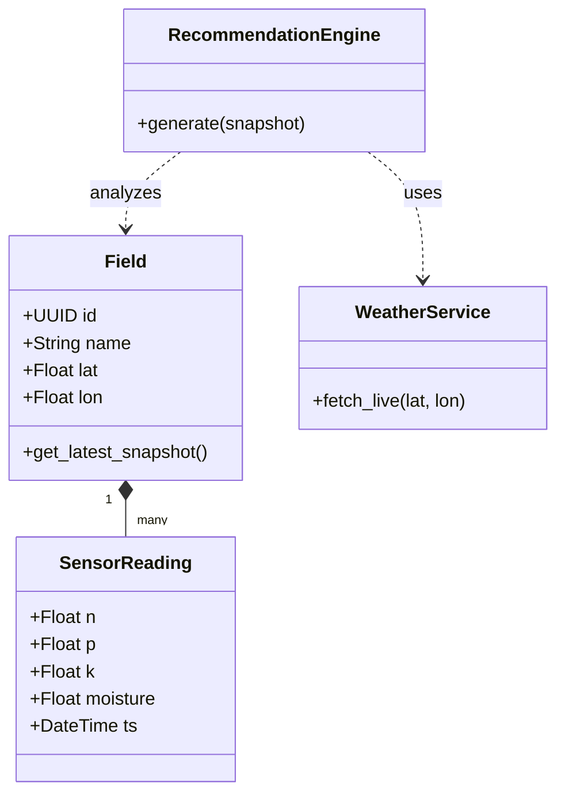
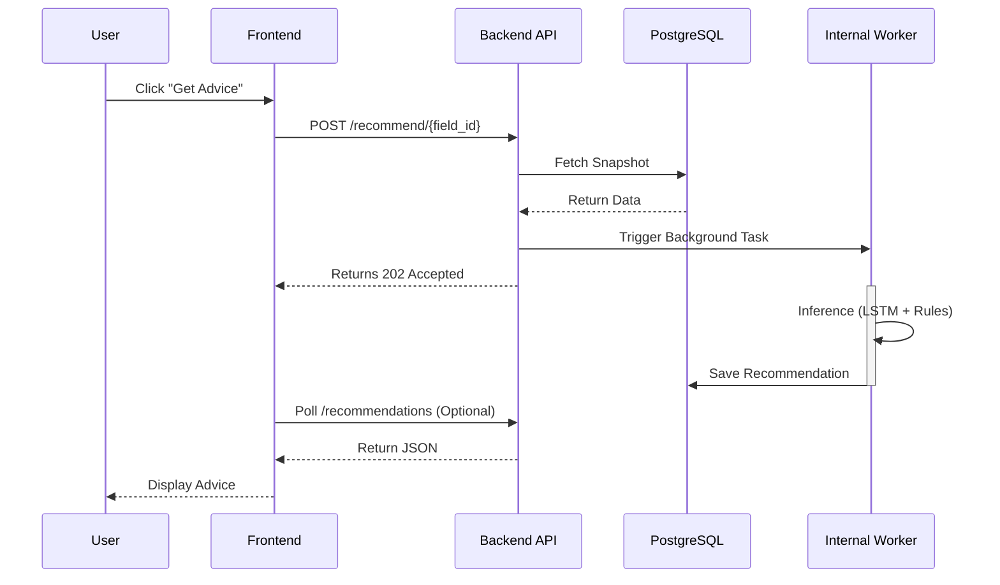
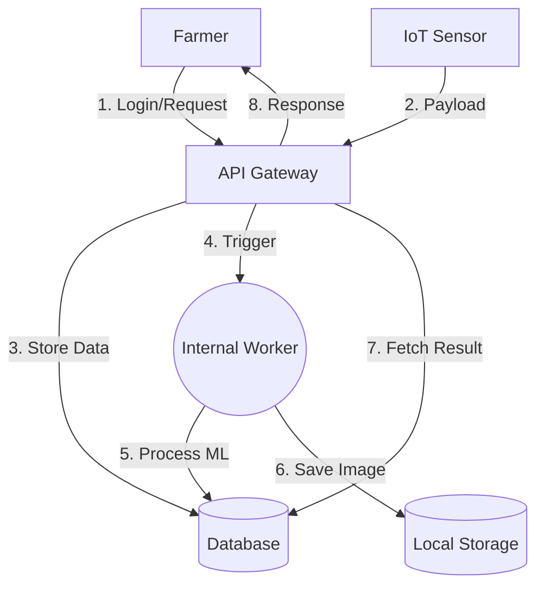

# Mermaid Code for Project Diagrams

Since the automatic image generation is currently limited, please use the following **Mermaid JS** code to generate your diagrams. You can copy-paste these into [Mermaid Live Editor](https://mermaid.live/) or use a VS Code extension to export them as High-Resolution PNGs.

## 1. Use Case Diagram
*Matches internal BackgroundTask logic.*

```mermaid
usecaseDiagram
    actor Farmer
    actor "IoT Sensor" as Sensor
    actor "Weather Service" as Weather
    
    package "Smart Crop System" {
        usecase "Login / Register" as UC1
        usecase "Manage Fields" as UC2
        usecase "View Recommendations" as UC3
        usecase "Upload Crop Images" as UC4
        usecase "Ingest Sensor Data" as UC5
        usecase "Fetch Forecast" as UC6
    }

    Farmer --> UC1
    Farmer --> UC2
    Farmer --> UC3
    Farmer --> UC4
    Sensor --> UC5
    Weather --> UC6
    UC3 ..> UC6 : <<include>>
    UC3 ..> UC5 : <<include>>
```

## 2. Class Diagram
*Matches `models.py` and `schemas.py`.*



## 3. Sequence Diagram (Recommendation Flow)
*Correctly shows 202 Accepted and Internal Worker.*



## 4. Component Diagram
*Removes external Redis/S3 to match Prototype.*

```mermaid
graph TD
    subgraph Client
        UI[Frontend (React)]
    end
    
    subgraph "Backend Container"
        API[FastAPI Service]
        Auth[Auth Module]
        Ingest[Ingestion Module]
        Worker[Internal Worker Board]
    end
    
    subgraph Storage
        DB[(PostgreSQL)]
        Vol[(Local Disk /static)]
    end
    
    Ext[External Weather API]

    UI -->|JSON| API
    API --> Auth
    API --> Ingest
    API -->|Async Trigger| Worker
    
    API -->|SQL| DB
    Worker -->|SQL| DB
    
    API -->|Save| Vol
    Worker -->|Read| Vol
    API -->|HTTP| Ext
```

## 5. DFD (Level 1)
*Shows Data Flow without external queues.*


